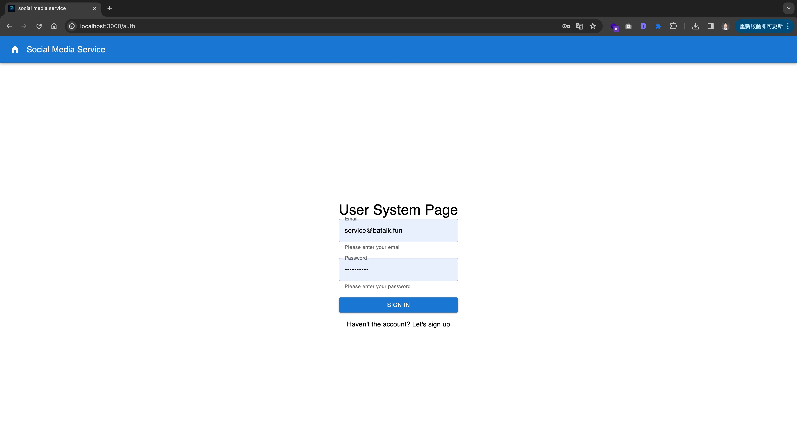
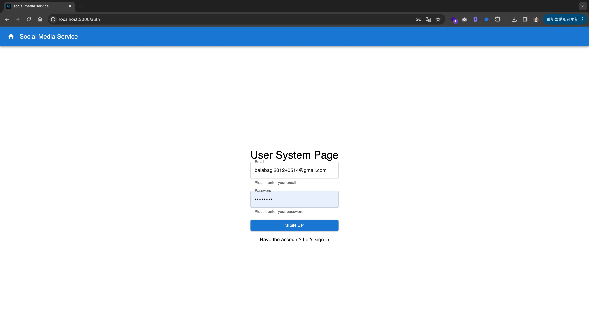
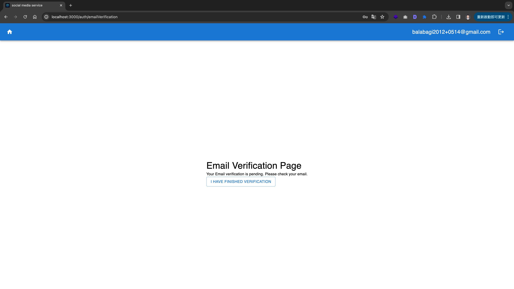
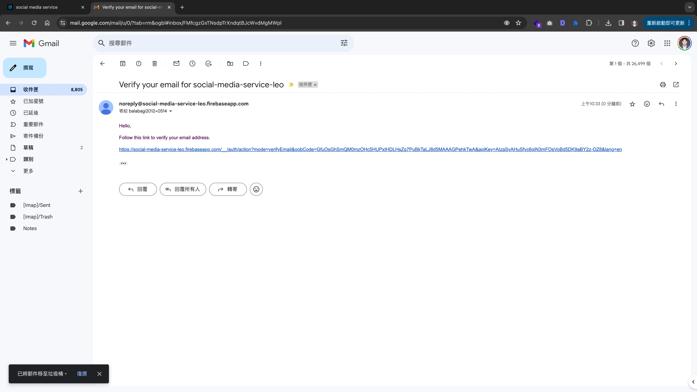
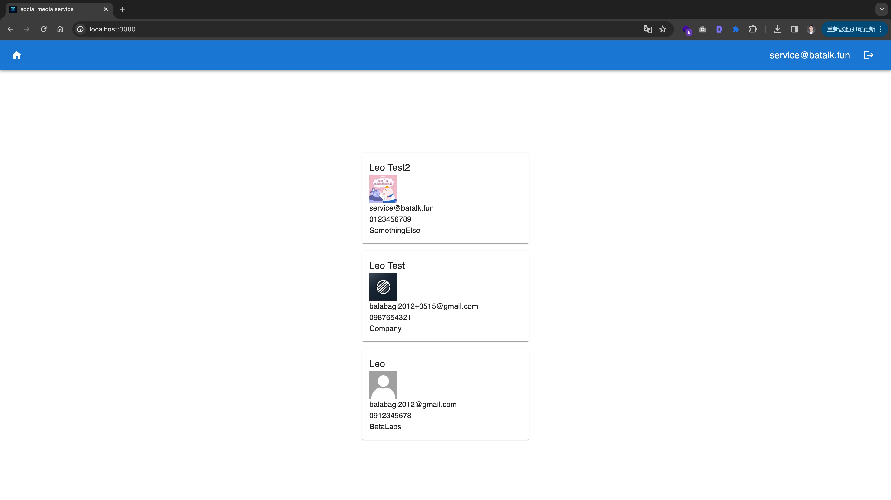
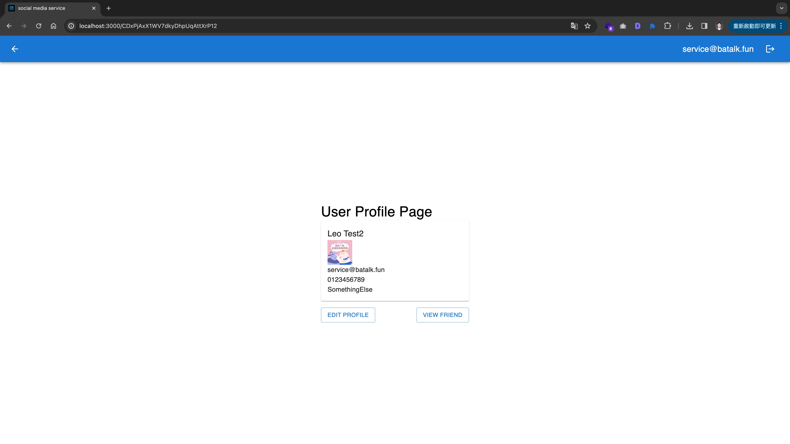
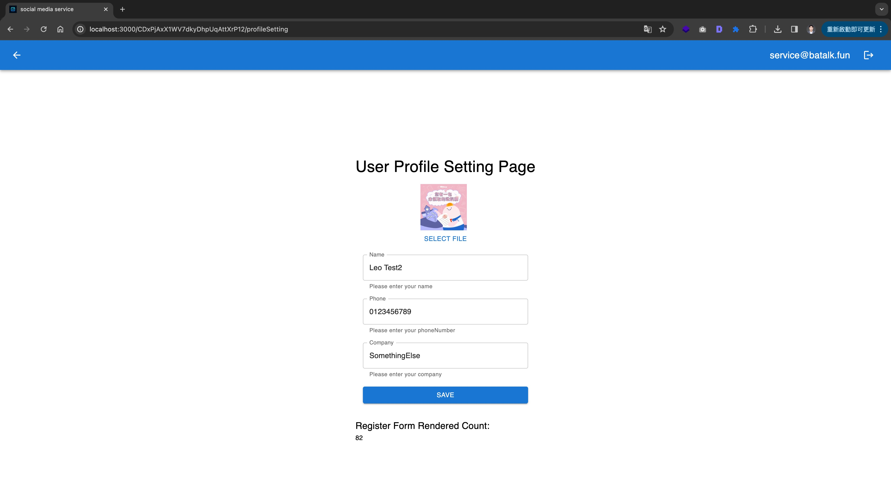
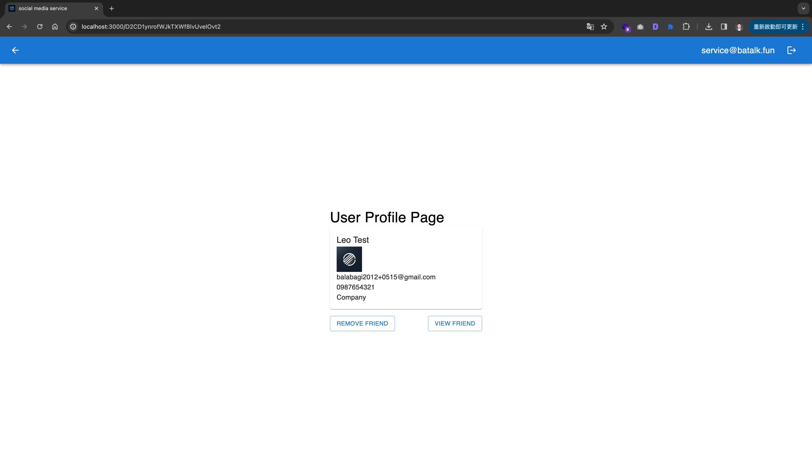
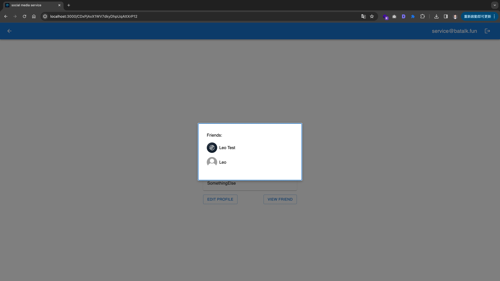

# social media service

social media service is a mock social media website prototype designed for users to connect with friends and register using their email addresses. It provides basic functionalities such as adding friends, creating user profiles, and viewing user's friends. This project aims to demonstrate the fundamental features of a social networking platform while serving as a learning tool for web development enthusiasts.

## Key Features

- User registration and authentication via email and password
- Profile creation and customization
- Adding and removing friends
- A render counter in register page in real time
- View a user's profile by user ID, and a button to add the user as a friend, if not already added or viewing one's own profile
- Can show a user's friends

## Design and explanations

### Framework

- Web: Nextjs
- Storage & Database & Authentication & RealTime: Firebase
- Container: Docker

### Folder Structure

```
.
├── node_modules/            # Node.js 套件
├── public/                  # 靜態檔案，如圖片
│   ├── images/
├── src/                     # 原始碼
│   ├── components/          # React 元件
│   ├── lib/                 # 函式庫和工具
│   ├── pages/               # Next.js 頁面
│   └── styles/              # CSS 或 SCSS 樣式檔案
├── .gitignore               # Git 忽略的檔案或資料夾
├── package.json             # Node.js 套件和腳本
├── README.md                # 專案說明文件
└── yarn.lock                # Yarn 套件版本鎖定檔案
```

### Explanations

Because this service is primarily focused on developing features for social media,
there is a certain demand for concurrent read and write operations.
Additionally, most of the stored data is in an unstructured format.
Therefore, for the database, I choose to use a NoSQL DB.

As I aim to simplify the email authentication process,
I have decided to utilize Firebase for identity verification.
Additionally, I leverage its existing Storage service and Realtime features,
which help reduce the development costs associated with these functionalities.

### Demo

[Here you are](https://social-media-service.vercel.app/)

#### SignInPage



#### SignUpPage



#### EmailVerificationPage



#### EmailAuth(Gmail)



#### HomePage



#### UserProfilePage



#### UserProfileSettingPage



#### OtherUserProfilePage



#### ViewUserFriendPage



## Getting Started

Make .env by following .env.example

Run the development server in local:

```bash
yarn dev
```

Run the development server by docker:

```bash
docker build -t social-media-service .
docker run -p 3000:3000 -d social-media-service
```

Open [http://localhost:3000](http://localhost:3000) with your browser to see the result.

After that, you can do sth e2e testing:

```bash
yarn e2e
```
